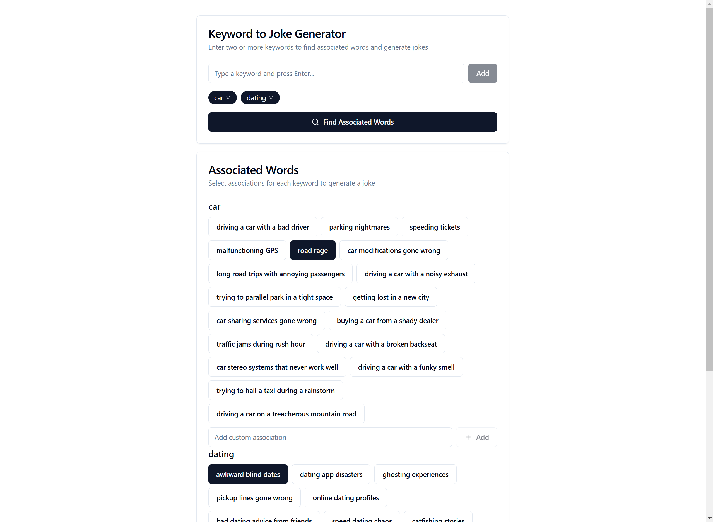

# Joke Writer

Web Application Ai Agent to generate joke using the Incongruity technique

## Features
- Interactive web application
- Uses the LangGraph framework for natural language processing to help joke generation.
- Uses LLM to make two incongruent topics to create a joke
- Serverless backend API services

## Requirements

- Python 3.12
- Required Python libraries (see `requirements.txt` for details).
- Groq API Key

#### Groq
  1. Create Groq API key. You can retrieve the key from the [GROQ Console](https://console.groq.com/keys).

## Server Deployment

When installing dependencies for lambda

### Install dependencies with x86 platform
```
pip install -r ./requirements.txt --platform manylinux_2_17_x86_64 --only-binary=:all: --target ./{virtenv}/Lib/site-packages --upgrade --no-cache-dir
```

Create zip file
`Compress-Archive .\joke-writer-env\Lib\site-packages\* aws_lambda.zip`
`Compress-Archive .\service\* -Update aws_lambda.zip ` <-- run as you update service

## Client Deployment 

### packaging client
`npm run predeploy`
- this generates 'out' folder

### upload files + folder(s) to s3

## Sample App

